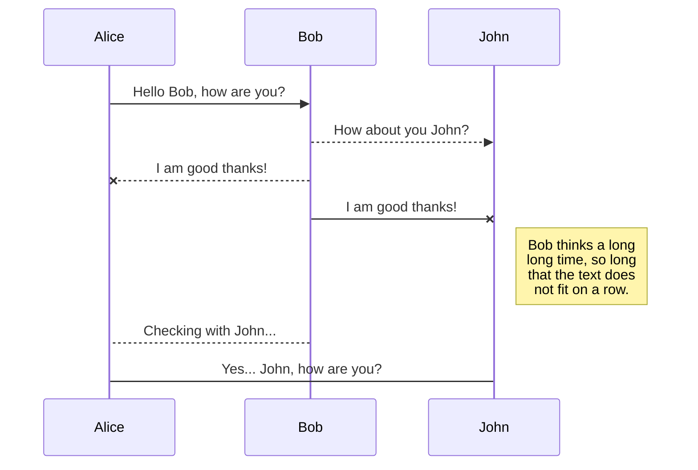

# Welcome to StackEdit!
Source code and makefile for the Dunnet game. Adapted for Kenyon College's campus, this version starts at the outside of Bexley Hall, and moves its way east to Eaton Center, then south down Middle Path to Peirce Hall, where there is (if everything works out), an IBM mainframe that the user will have to put things into and get information out of.
Kenyon College F19 - SCMP 318 Software Development, Prof. Jim Skon
The full specifications for the original project can be found [here](https://cs.kenyon.edu/do/view/Main/XMLGameDesign).
# Files

## /DunnetKC

The current version of the Dunnet game.

## /DunnetKC/Zork

A version of the Zork game that uses the xmlParser v2.42 package from Fank Vanden Berghen to attempt to parse XML. Doesn't work the way that I'd like it to, and might be broken. I gave up on this version.

## /DunnetKC/Spider

A version of the Zork game, codename Spider, that uses the Pug XML (pugixml) v1.10 parser  package from Arseny Kapoulkine to parse the XML. This version is broken, and I gave up on it.

## The License

The software here is licensed under the MIT license, which can be found in the LICENSE file in /DunnetKC.

## UML diagrams

You can render UML diagrams using [Mermaid](https://mermaidjs.github.io/). For example, this will produce a sequence diagram:

